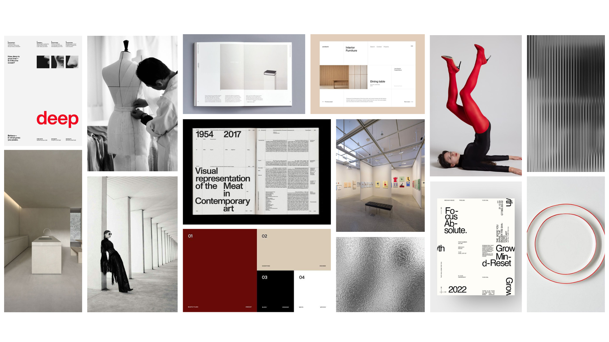

# Trabajo-final
## Objetivo General
Diseñar y desarrollar un portafolio digital profesional que comunique de forma clara y atractiva mis competencias como diseñadora gráfica con especialización en UX/UI, con el propósito de fortalecer mi identidad profesional y aumentar las oportunidades de vinculación laboral en el ámbito del diseño.

---

## Usuarios

### Product Owner - Usuario Extremo 1
**Nombre:** Sebastián Vargas  
**edad:** 38 años 
**cargo:** Product Owner en empresa tecnológica multinacional 

**Comportamientos y Creencias**
  - Busca diseñadores con pensamiento estratégico y capacidad para trabajar con equipos ágiles.
  - Cree que un buen diseño debe resolver problemas reales del usuario, no solo ser estéticamente agradable.
    
**Demografía**
  - Vive en Santiago, trabaja de forma híbrida.
  - Experiencia en gestión de productos digitales y metodologías ágiles (Scrum).
    
**Necesidades y Objetivos**
  - Identificar profesionales que comprendan procesos de diseño centrados en el usuario.
  - Valora portafolios que comuniquen claramente el proceso detrás del diseño, no solo el resultado visual.

---

### Diseñadora Senior - Usuario Promedio
**Nombre:** Camila Pino 
**Edad:** 30 años 
**Cargo:** Directora de arte y diseñadora UX/UI en agencia creativa

**Comportamientos y Creencias**
  - Constantemente revisa portafolios en busca de colaboradoras jóvenes con estilo y criterio visual.
  - Cree que la presentación de proyectos revela tanto la madurez como la claridad profesional del diseñador/a.

**Demografía**
- Vive en Santiago, trabaja de manera remota.
- Experiencia en branding y diseño digital.

**Necesidades y Objetivos**
- Encontrar diseñadoras que puedan integrarse fácilmente al flujo de trabajo de la agencia.
- Valorar portafolios con una identidad coherente y navegación intuitiva.
  
---

### Reclutadora de Talentos - Usuario Extremo 2
**Nombre:** Carolina Espinoza  
**Edad:** 35 años 
**Cargo:** Analista Senior de Atracción de Talento en empresa nacional.

**Comportamientos y Creencias**
- Evalúa decenas de portafolios semanalmente.
- Cree que la claridad, profesionalismo y estructura del sitio reflejan la seriedad del postulante.

**Demografía**
- Vive en Las Condes, trabaja en oficina.
- Maneja procesos de selección de perfiles creativos y tecnológicos.

**Necesidades y Objetivos**
- Acceder rápidamente a información relevante (habilidades, proyectos, contacto).
- Valorar portafolios que comuniquen personalidad y competencias técnicas de forma equilibrada.

---

## Antecedentes – Portafolios de Referencia

A continuación se presentan seis sitios web que sirven como **referentes para la creación de mi portafolio personal**.

---

## **1. Other – Free Portfolio Template (Framer)**  
**🔗 Fuente:** [https://other-template.framer.website/](https://other-template.framer.website/)

**📸 Imagen:**  

**📝 Qué es:**  
Una plantilla minimalista para portafolios creativos desarrollada en **Framer**, que permite presentar proyectos en formato cuadrícula, lista o imagen completa.  

**➕ Aspectos positivos:**  
- Estética limpia y moderna que pone el foco en los proyectos.  
- Distintas grillas para mostrar los proyectos.
- Interacciones simples pero efectivas.  

**➖ Aspectos negativos:**  
- Al ser una plantilla popular, puede perder diferenciación visual.
- Problemas de visualización en el menú de navegación. Podría agregarse un efecto glass. 

---

## **2. Ross Mason – Digital Artist / 3D & Motion Portfolio**  
**🔗 Fuente:** [https://iamrossmason.com/](https://iamrossmason.com/)

**📸 Imagen(es):**  

**📝 Qué es:**  
Portafolio personal de un artista digital especializado en **3D, motion y dirección de arte**, con desplazamiento horizontal y fuerte impacto visual.

**➕ Aspectos positivos:**  
- Diseño innovador con navegación horizontal y animaciones atractivas.  
- Presentación propia y de los proyectos simple pero atractiva.
- Buen uso de la tipografía como elemento estético.

**➖ Aspectos negativos:**  
- Navegación poco intuitiva.
- Demasiados apartados para un portafolio.

---

## **3. Atelier Matin – Estudio de Diseño Gráfico e Ilustración**  
**🔗 Fuente:** [https://www.ateliermatin.com/](https://www.ateliermatin.com/)

**📸 Imagen(es):**  

**📝 Qué es:**  
Estudio francés que combina **diseño gráfico, ilustración e identidad visual**, con una presentación limpia y profesional.  

**➕ Aspectos positivos:**  
- Diagramación clara tipo grid con equilibrio entre tipografía e imagen.
- Paleta neutra que resalta los proyectos.
- Diagramción atractiva de galeria en proyectos.

**➖ Aspectos negativos:**  
-  Menú de navegación poco claro, se refuerza con flechas y mensajes de ayuda que estorban.

---

## **4. Gentle Systems – Estudio de Ingeniería Creativa**  
**🔗 Fuente:** [https://www.gentle.systems/](https://www.gentle.systems/)

**📸 Imagen(es):**  

**📝 Qué es:**  
Estudio interdisciplinario que une **diseño, tecnología e innovación**, con una estética experimental y clara estructura visual.  

**➕ Aspectos positivos:**  
- Sección de about us simple y bien estructurada.
- Experiencia de navegación minimalista.  

**➖ Aspectos negativos:**  
- Problemas con algunos textos e imagenes que son demasiado pequeños.
- Navegación más conceptual que práctica.

---

## **5. María José Aguayo Ibarra – Portafolio Personal (MyPortfolio)**  
**🔗 Fuente:** [https://mariajoseaguayoibarra.myportfolio.com/work](https://mariajoseaguayoibarra.myportfolio.com/work)

**📸 Imagen(es):**  

**📝 Qué es:**  
Portafolio personal realizado con **Adobe MyPortfolio**, enfocado en diseño gráfico e ilustración.  

**➕ Aspectos positivos:**  
- Interfaz clara, fácil de navegar y mantener.  
- Ideal para mostrar trabajos gráficos personales.  

**➖ Aspectos negativos:**  
- Portafolio clásico que no se diferencia de otros.

---

## **6. Gordon von Steiner – Portafolio Personal**  
**🔗 Fuente:** [https://gordonvonsteiner.com/](https://gordonvonsteiner.com/)

**📸 Imagen(es):**  

**📝 Qué es:**  
Portafolio personal centrado en **identidad visual, dirección creativa y diseño contemporáneo**, con un estilo visual fuerte y cinematográfico.  

**➕ Aspectos positivos:**  
- Gran identidad personal y coherencia estética.  
- Buen uso de imagen y narrativa visual.  

**➖ Aspectos negativos:**  
- Falta de información textual detallada en cada proyecto.

---

## Referentes - Moodboard

El moodboard presenta una **estética minimalista y editorial**, con énfasis en el **contraste entre tonos neutros y acentos rojos**.
Refleja orden, elegancia y precisión, inspirándose en el arte contemporáneo, la moda y la arquitectura. Además **destaca la tipografía y la composición limpia** como ejes visuales.

